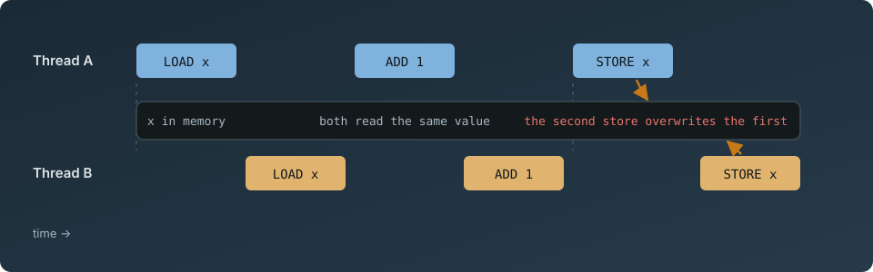

(cover)=
*Races, atomics, locks and memory ordering, run in your browser and read down to the instruction.*

A hands-on book for engineers who want to understand what happens underneath concurrency
primitives, starting from basic C and ending at atomics, memory ordering, cache coherence and
machine instructions. Each chapter asks one question, answers it with a program small enough to
read in one glance, runs that program on real threads in the page, and then shows what the
compiler made of it on x86-64, AArch64, RISC-V and WebAssembly. You change one thing and run it
again. Spinlocks, mutexes, lock-free stacks and RCU appear only once you have met the problem each
one solves. You need basic C and nothing else: no threads, atomics, memory models, assembly or
processor architecture are assumed. [Before you start](#before-you-start) gives you the notation
the book uses; [the Preface](#preface) says how a chapter works.

By Chris Snow, in collaboration with Claude (Anthropic)

% number-ok: the names of the two licences, which carry their version numbers
The prose and figures are under [CC BY-NC 4.0](https://github.com/snowch/concurrency-book/blob/main/LICENSE); the code is under [Apache 2.0](https://github.com/snowch/concurrency-book/blob/main/LICENSE-CODE).
